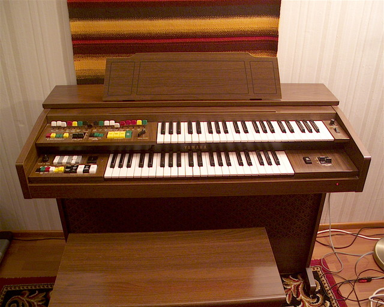

# Introduction

This project is about to build an organ MIDI controller from a vintage Yamaha B-35N organ. The controller is
connected to two keyboards, one octave pedals and an expression pedal with a switch. The controller can be used
with various kind of sofrtware synthesizers, especially with tone wheel organ or classical organ (Hauptwerk).

# Controller

## Prototype

The prototype version of the controller was implemented on Vero strip board. 

